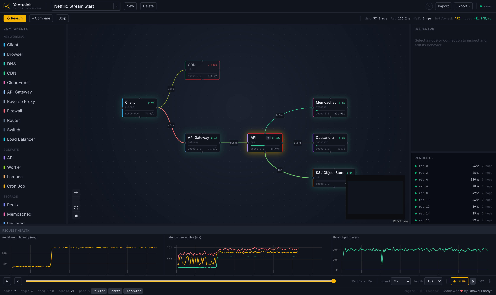

# Yantralok

**Behavioral CAD for software systems.** Design a distributed system on a canvas, give each component realistic numbers, generate traffic, and _watch it behave_: find the bottleneck, inject failures, and see the cascade, all before anything is deployed.

It's to architecture diagrams what finite-element simulation is to a bridge drawing: the diagram isn't documentation, **the diagram is the system**. Every box is a behavioral model, every line carries requests, every property changes the outcome.

Runs **entirely in the browser**, local-first, no backend, no account.

<p align="center">
  <a href="https://dhawal-pandya.github.io/Yantralok/">
    
  </a>
</p>

<p align="center"><strong><a href="https://dhawal-pandya.github.io/Yantralok/">▶ Try it live</a></strong>, no install, it runs right in your browser.</p>

> New here? Start with the **[Usage Guide](docs/USAGE.md)**, a hands-on walkthrough written for a working engineer.

---

## Why

An engineer with only the codebase is usually blind to how the system behaves in production, that knowledge lives with seniors, which is exactly why high/low-level design gate senior interviews. Yantralok lets you model the system you already work on, crank the request rate, kill any node, and watch where it actually falls over.

The contract: **you own the inputs, the engine owns the consequences.** It doesn't predict your Redis latency, you supply that. It predicts what _emerges_ from your numbers under load (bottlenecks, latency accumulation, queue overflow, retry cascades) via closed, validated laws (Little's Law, resource conservation, retry/timeout amplification). Results are deterministic: same `graph + seed + interventions` → byte-identical run.

## Quickstart

```bash
npm install
npm run dev      # open the printed URL
```

Then either build `Client → API → Postgres` by hand, or load a shipped demo from **Examples ▾** in the toolbar. Press **Space** to run. See the [Usage Guide](docs/USAGE.md) for the full tour.

Requires Node 18+.

## What works today (the build plan is complete)

- **Design**, a canvas with **29 components** across Networking / Compute / Storage / Messaging / Infrastructure; drag onto the canvas or click to place, connect, and configure with sane editable defaults; resizable panels; every control explains itself on hover.
- **Simulate & observe**, run a workload over a configurable horizon, stream live latency / throughput / utilization / queue-depth; per-node ρ, hit rate, and call counts; data-driven packet animation; automatic bottleneck and root-cause surfacing. Raise the Client's request rate to stress-test to any scale.
- **Legibility layer**, an opt-in ambient glow tints nodes and wires by health (green→red) and lights up the critical path, so a run reads at a glance; a once-only guided tour onboards a first-time visitor.
- **Realistic load & resilience**, burst / periodic / ramp workload shapes and service-time distributions (p99 ≠ mean); retry backoff + jitter, circuit breakers, and parallel fan-out (latency = the slowest branch, not the sum).
- **Elastic capacity**, HPA-style autoscaling that lags the spike; Postgres/MySQL read replicas with replication lag and stale reads; cache hit/miss (`DB load ≈ (1−h)·λ`) with memory/eviction pressure.
- **Async messaging & connections**, Kafka / SQS / RabbitMQ / NATS / Queue brokers with consumer lag and pub/sub fan-out; DNS / TLS / keep-alive connection lifecycle.
- **Sharding & quorum**, horizontally sharded stores (a dead shard drops only its slice) and masterless quorum replication (Cassandra: W / R / RF, with the stale-read overlap law).
- **Failure injection & time travel**, kill / restart / delay / partition any node (editable timing); pause, rewind, scrub, and **compare** timelines (with vs without the failure).
- **Request waterfall**, click any request to see its whole life as a nested trace: each hop split into network / queue-wait / service, with retries and timeouts labeled; the total equals the request's measured latency.
- **Scenario library**, Lessons 1–14, seven Showcases (capped by a 29-type "Frankenstein" that stays green under load), and eleven Company architectures, each a `.yantra` file loaded through the normal importer.
- **Persistence & export**, multiple systems saved locally (IndexedDB); import/export `.yantra` files; export **Mermaid** diagrams and **Markdown simulation reports**.
- **Determinism**, seeded PRNG + logical clock; golden-trace and replay-equivalence are first-class tests.

Honesty is enforced: a control either changes the run or is visibly tagged **not simulated**. The full plan (the completed Phases 0–9, then fidelity + UI milestones M1–M13) is documented in [ROADMAP-0.md](docs/ROADMAP-0.md) and [ROADMAP-1.md](docs/ROADMAP-1.md). Still deferred by design: a backend, auth, infrastructure importers, and the Kubernetes / consensus component families.

## Tech stack

TypeScript end to end · Vite · React · React Flow (canvas) · Zustand · Tailwind + shadcn/ui · uPlot (charts) · Zod (schema/validation) · Dexie/IndexedDB (persistence) · Vitest. The simulation engine is **pure TypeScript**, no DOM, no wall-clock, no unseeded randomness, so it runs in Node, is testable, and can move to a Web Worker unchanged.

## Project layout

```
src/
  engine/      Pure deterministic discrete-event engine (the crown jewel)
  schema/      The versioned Zod document model + types, shared everywhere
  components/  Component library (parameter profiles over engine laws) + compile
  document/    Document ops, the persistence seam, .yantra + Mermaid/report export
  ui/          React app: canvas, inspector, charts, packet overlay, run controls
  scenarios/   Shipped demos as .yantra files, loaded via the normal importer
docs/          DESIGN.md · ROADMAP-0.md · ROADMAP-1.md · DECISIONS.md · USAGE.md
CLAUDE.md      The vision and philosophy
```

The dependency rule points inward, `ui → document → components → engine → schema`: and is enforced by lint; `engine/` may import only `schema/`.

## Scripts

| Command         | Does                                      |
| --------------- | ----------------------------------------- |
| `npm run dev`   | Vite dev server                           |
| `npm test`      | Run the Vitest suite                      |
| `npm run build` | Typecheck + production bundle             |
| `npm run lint`  | ESLint (incl. the engine purity boundary) |
| `npm run check` | Lint + test                               |

## Documentation

- **[Usage Guide](docs/USAGE.md)**, how to use the product (start here).
- **[CLAUDE.md](CLAUDE.md)**, vision and philosophy.
- **[DESIGN.md](docs/DESIGN.md)**, architecture, engine, document model, fidelity.
- **[ROADMAP-0.md](docs/ROADMAP-0.md)**, the completed phased build plan (Phases 0–9).
- **[ROADMAP-1.md](docs/ROADMAP-1.md)**, the completed fidelity + UI milestones (M1–M13).
- **[DECISIONS.md](docs/DECISIONS.md)**, the full ADR-style decision log.

## Status

Local-first v1: the phased build (0–9) and the fidelity + UI milestones (M1–M13) are complete. No backend, auth, or AI yet, all deliberately deferred behind stable seams (see the ADRs in [DECISIONS.md](docs/DECISIONS.md)).
